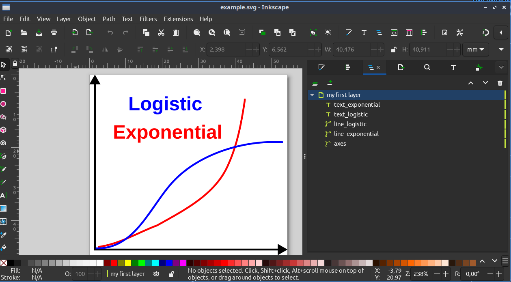

# ProgresSVG

A [Quarto](https://quarto.org/) extension for progressively revealing/hiding SVG elements in [reveal.js](https://revealjs.com/) presentations.

Build up complex diagrams step by step using layer labels as element identifiers.

<br><br><br>

## Installation

`quarto add rodrigo-j-goncalves/progressvg`

<br><br><br>

## Usage

Add the filter to your document's YAML header:

```

---
title: "My Presentation"
format: revealjs
filters:
  - progressvg
---
```


Then use `.progressvg` divs to show or hide SVG elements.

I progressively reveal the objects using  `. . .` pauses:


```
## Dataviz & Narrative

::: {.progressvg file="diagram.svg" element="axes"}
:::

. . .

::: {.progressvg file="diagram.svg" element="data_points"}
:::

. . .

::: {.progressvg file="diagram.svg" element="trend_line_and_legend"}
:::
```


Each `. . .` creates a reveal.js fragment — pressing Space/Right advances through them one at a time.

<br><br><br>

## Attributes

`{.progressvg file="mydiagram.svg" element="red_square" action="hide"}`
<br>

| Attribute  | Required | Description |
|------------|----------|-------------|
| `file`     | Yes      | Path to the SVG file (relative to the QMD) |
| `element`  | Yes      | ID (or Inkscape label) of the element to show/hide |
| `action`   | No       | `show` (default) or `hide` |

<br><br><br>

## Hiding elements

You can also hide previously shown elements using `action="hide"`:

```
::: {.progressvg file="diagram.svg" element="old_data" action="hide"}
:::
```

<br><br><br>

## How to assign labels to each SVG element?

I use Inkscape to create SVG elements to be shown in my presentations (see below), but this extension should also work with non-Inkscape-generated SVG files.



<br><br><br>

## How SVG Labels Work: if you use [Inkscape](https://inkscape.org/)

ProgresSVG uses **Inkscape labels** (`inkscape:label` attributes) to identify elements in your SVG. In Inkscape:

1. Select an element (path, text, shape, etc.)
2. Open **Object Properties** (Object > Object Properties, or `Ctrl+Shift+O`)
3. Set the **Label** field to a descriptive name (e.g., `axes`, `trend_line`, `title_text`)

The label you set in Inkscape becomes the `element` value in your QMD file[^1]

**Note:** In Inkscape SVGs, all labeled elements start hidden.

<br><br><br>

## If you DON'T use Inkscape

If there is no `label` field, then you would use the `ID` field instead.

So instead of 

`{.progressvg file="myfile.svg" element="object_label"}`

you would use 

`{.progressvg file="myfile.svg" element="object_ID"}`


Elements referenced by `.progressvg` divs start hidden (opacity 0) and are revealed on click. 

Be sure the SVG file only has the objects you need: those objects not referenced will be visible at all times and you can not hide them!

## Transitions

ProgresSVG respects the reveal.js `transition` and `transitionSpeed` settings from your YAML header:

```
format:
  revealjs:
    transition: slide
    transition-speed: fast
```

- `transition: none` disables opacity animations
- `transition-speed: fast` uses 0.2s, `default` uses 0.4s, `slow` uses 0.8s

<br><br><br>

## Example

See the [`example/`](example/) directory for a working demo. To render it:

```
cd example
quarto render example.qmd
```

<br><br><br>

## License

MIT

[^1]: Group elements (`<g>`) are also supported
